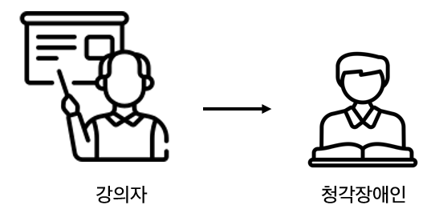
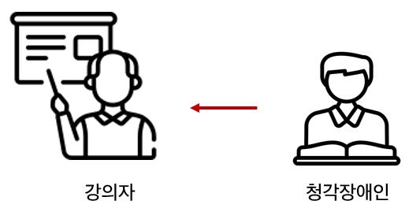
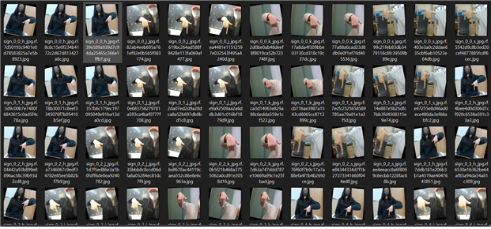
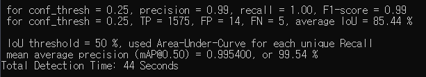
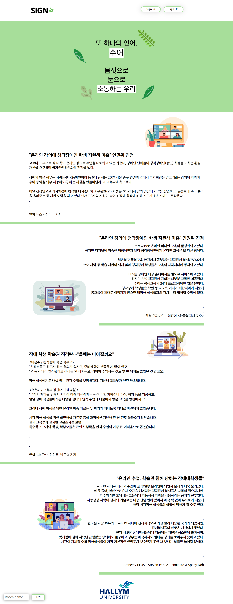
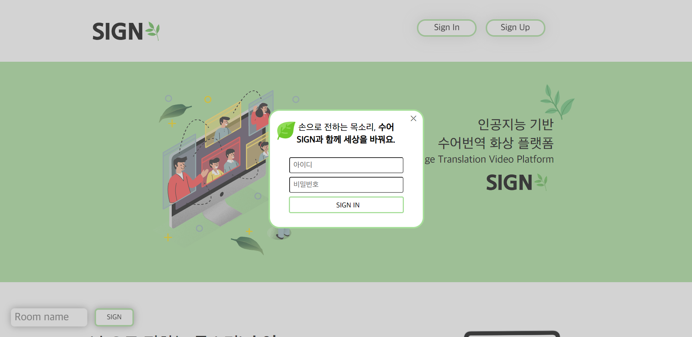
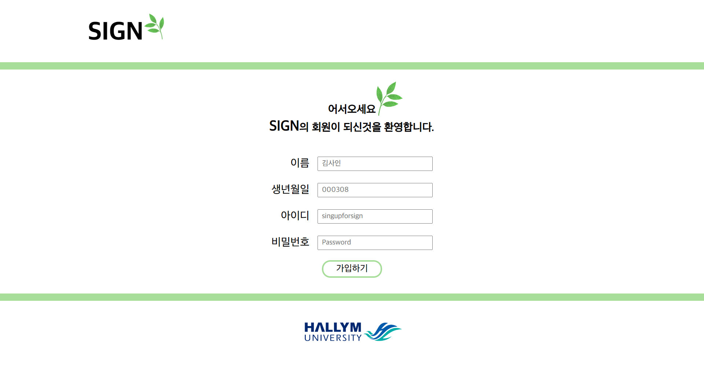
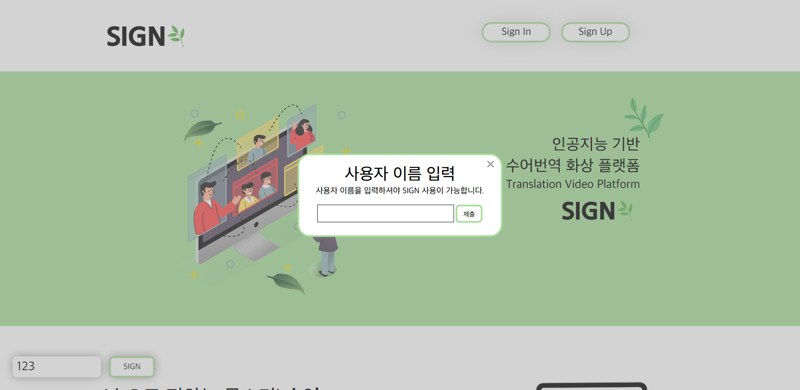
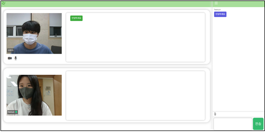

# 청각장애인들을 위한 비대면 교육 플랫폼 개발

해당 프로젝트는 2022학년도 1학기 캡스톤 디자인 프로젝트 입니다.


## Contents
1. [Introduce](#🌱_청각장애인들을_위한_비대면_교육_플랫폼_개발)
1. [Differentiation](#Differentiation)
2. [Team](#Team)
3. [Install](#Install)
4. [Requirements](#Requirements)
5. [Technology Stack](#Technology_Stack)
6. [Deep Learning](#DeepLearning-Model)
    - [Custom dataset](#Custom_dataset)
    - [Model & Hyper Parameters](#Model_&_Hyper_Parameters)
    - [Training](#Training)
    - [Result](#Result)
4. [FullStack](#Full_Stack)
    - [Front-End](#Front-End)
    - [Back-End](#Back-End)     
8. [Demonstration](#Demonstration )
   - [Main-Page](#Main-Page)
   - [Sub-Page](#Sub-Page)     
   - [Sign In & Sign Up](#Sign_In_&_Sign_Up)
   - [Live - Chat Room](#Live_-_Chat_Room)   
9. [Timetable](#Timetable)
10. [Design  document](#Design_document)     
11. [Test document](#Test_document)
12. [Weekly work Report](#Weekly_work_Report)   


## 🌱 청각장애인들을 위한 비대면 교육 플랫폼 개발

코로나 19 사태로 인해 대부분의 초·중·고교에서 대면 수업과 온라인 수업을 진행하고 있다. 일반적인 대학교의 온라인 강의는 ZOOM이나 학교 자체 동영상 강의 플랫폼을 활용한다. 그러나 비대면 수업은 대부분 강사의 입이 화면에 나타나지 않거나 강의자료만 표시된다. 장애인차별법 14조는 교육관리자가 수어통역, 문자통역, 자막 등 의사소통 수단을 적극 고안/제공하도록 규정하고 있지만, 시간과 비용상 어려움이 있어 이 같은 지원이 어렵다. 따라서 이번 캡스톤 프로젝트를 통해 **청각장애인을 위한 음성 및 수화 번역 교육 플랫폼**을 만드는 것을 목표로 하고 있다. 기술 개발은 크게 두 가지로 나뉜다.

| <p align="center"> | <p align="center"> |
| ------------------------------------------------------------ | ------------------------------------------------------------ |


1) 실시간 전송되는 강사의 음성이 텍스트로 변환되어 화면에 전송한다.
2) 청각장애인의 수화를 텍스트로 변환해 화면에 전송한다. 

이 기술들은 STT API를 사용하고(1) 객체 감지를 위해 직접 구축한 수화 데이터 세트와 Darknet YOLOv4를 사용하여 구현된다(2). 이를 통해 **강의자와 청각장애인, 청각장애인과 강의자가 원활한 의사소통이 되도록 하는 것**을 ~~수정~~


# Differentiation

기존의 화상 통화 플랫폼 중 가장 대중적인 ZOOM을 예로 들었을 때, 현재 ZOOM에서는 영어 자막만 지원하고 있으며 한국어는 지원하고 있지 않다. 또한, 수화 번역 기술이 없으며 해당 제품을 설치해야 화상통화에 참여가 가능하다. 본 프로젝트에서는 청각장애인 또한 활발하게 화상통화에 참여할 수 있도록 **수어 번역이 가능**하며, **실시간으로 한국어 자막을 제공**한다. 추가적으로 별다른 설치가 필요없이 참여 공간에 구애 받지 않고 **웹 브라우저에서 바로 구동이 가능**하며, **화상 플랫폼 내에서 파일 전송/다운이 가능**하다. 


# Team

시작은 시작이조 (The beginning is the beginning)

|Name|Department|Contact|
|---|---|---|
| Jung Hee Sun | Major of Bigdata | glee623@naver.com|
| Lee Ye Jin | Major of Bigdata | leeye0616@naver.com|
| Lee So Eun | Major of Bigdata | dlth508@naver.com  |
| Kim Gang Su | Major of Bigdata | gangsu1813@naver.com|


# Coach

|Name|Department|Contact|
|---|---|---|
| Hou Jong Uk | Hallym Univ(Prof.) | juhou@hallym.ac.kr


# Install

```
from http import server
import re
from socket import socket
from flask import Flask,render_template,request  # 서버 구현을 위한 Flask 객체 import 

from numpy import broadcast  

from pyngrok import ngrok ,conf # 외부 접속 링크 생성
from flask_socketio import SocketIO, join_room, emit
import base64
import cv2
import numpy as np
import io
from PIL import Image
from collections import deque

import logging
log = logging.getLogger('werkzeug')
log.setLevel(logging.ERROR) 

from requests import request

import timeit
import time
from unicode import join_jamos
import cProfile
import re
```


```
conda install -c conda-forge pyngrok  
conda install -c conda-forge flask-socketio  
conda install -c anaconda flask  
```


# Requirements

`Python 3.7 ~ 3.9`

`CUDA Version 11.2`

`cuddn 7.6.5`

`flask 2.0.3`

`flask-socketio 5.1.0`

`pyngrok 5.1.0`


# Technology Stack

   

## Library

    

## API

`STT` 


# Deep Learning

## Custom dataset

[custom dataset 구축](https://github.com/yetniek/2022-1_capstone_design/tree/main/dataset_codes) 

데이터 셋은 한국어 수화의 자음 14개, 모음 17개로 총 31개의 글자를 한 사람 당 50장씩 약 1,550장을 구축하였다. 총 다섯명의 인원이 데이터 셋을 수집하였고 data augmentation을 활용해 이미지를 약 3배 정도 늘려 **총 23,250장** 의 데이터셋을 구축하였다. 또한, Vott를 활용하여 직접 라벨링 하였는데, 추가적인 데이터 셋을 구축할 때 Vott를 활용할 시 시간 소모가 커 라벨링을 자동화 시키기 위해 MediaPipe를 통해 손 부분에 바운딩 박스를 그려 마우스 클릭 시 해당 좌표를 저장하도록 설정해 데이터 라벨링을 진행하였다. 


<p align="center">


## Model & Hyper Parameters 

Darknet YOLOv4 사용


## Training

설명<br>


## Result




# Full Stack

More Details  [Sign-Language-Live-Chat](https://github.com/GangsuKim/sign-language-live-chat)

## Front-End

Socket.io와 WebRTC를 이용한 p2p 기반 실시간 화상 채팅 서비스를 개발하였다. 빠르게 진행되는 수화와 음성인식의 특성상 수직으로 수화 및 음성의 번역 채팅이 빠르게 전달되는 것을 사용자가 여유 있는 시간을 두고 인지 하고 반응 할 수 있도록 수평 구조로 음성 및 수화 번역 채팅을 표시하였다.

<br>

## Back-End

SIGN의 Back-end는 Python을 기반으로 구현된 deep-learning과의 연동을 위해 Python의 Flask 라이브러리와 Flask-socketio를 통해 Back-end를 구현하였다. Flask를 통해 Local 서버를 구현하고 Flask-socketio를 통해 Front-end와 Back-end와의 통신을 가능하게 하였다. 이후 기존의 Local 에서만 접속이 가능하던 한계를 보완하기 위해 ngrok를 이용하여 Local이 아닌 다른 PC 혹은 모바일 기기 에서도 접속이 가능하도록 구현하였다.

<br>


# Demonstration 

## Main Page


메인 화면의 좌측 상단에는 플랫폼의 이름이 적혀있고, 우측 상단에는 회원가입과 로그인을 할 수 있는 버튼이 있다. '지금 바로 시작하기' 버튼을 누르면 좌측 하단의 `Room name` 과 `sign` 으로 포커스가 이동한다. 

설명<br>


## Sub Page



<br>


## Sign In & Sign Up



​                                                                                       < 로그인 버튼을 누르면 나오는 화면 >

<br>



​                                                                                                < 회원가입 화면 >

<br>

## Live - Chat Room



​                                                                                       < SIGN 버튼을 누르면 나오는 화면 >

<br>





화상 채팅 실행 화면이다. 좌측에 화상 캠이 송출되고 User의 카메라가 상단에 위치한다. 좌측 하단에 캠과 마이크를 ON/OFF 할 수 있는 기능이 있으며 오른쪽 마우스 클릭시 수어 통역 모드가 켜진다. 송출 화면 우측에는 번역된 수어가 나온다. 우측에는 사용자간의 채팅이 가능하고, 채팅 상단에 있는 클립 아이콘을 누르면 파일 전송/다운이 가능하다. 

<br>


# Timetable

이미지


# Design document

이미지


# Test document

이미지


# Weekly work Report

이미지

